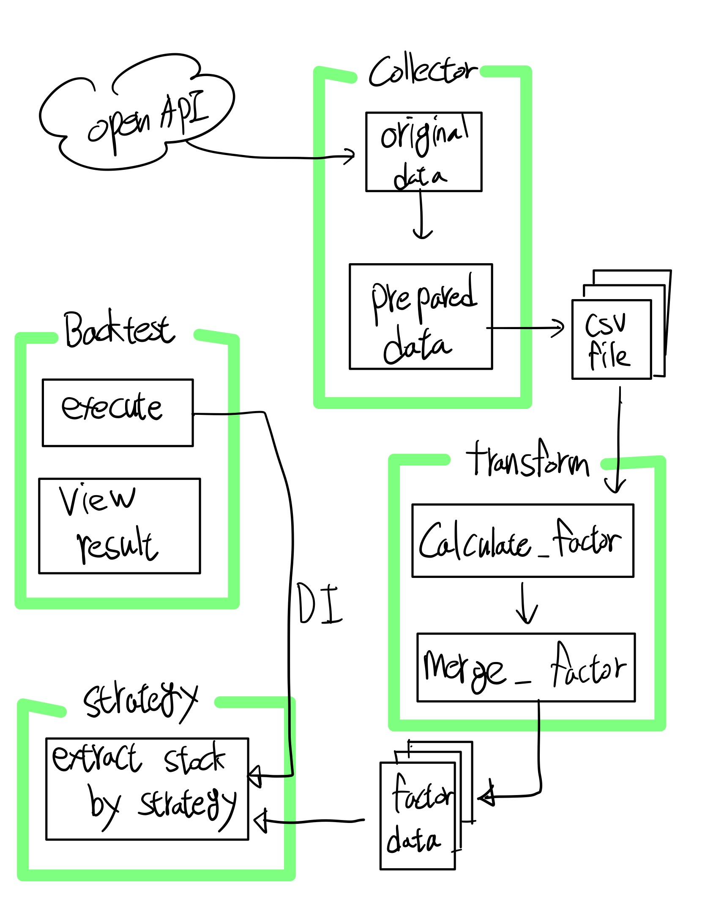

## 목차

## 프로젝트 실행 방법

```sh
$ python -v
$ pip install virtualenv
$ virtualenv venv
$ source venv/bin/activate
$ pip install -r requirements.txt
```

# System design

## Functional Requirements

- Dart, Krx open api를 사용해서 재무재표 데이터를 수집 과정이 필요합니다.
- 사용할 수 있는 지표 5가지 이상으로 생성합니다.
- 지표를 가지고 생성한 전략으로 종목을 필터링합니다.
- 추출된 종목을 가지고 최소 1년 이상의 기간으로 백테스트를 진행합니다.
- 백테스트 결과를 시각화하여 제시합니다.
- 종목별 수익률, 누적 수익률, Sharpe Ratio 등을 포함하여 시각화합니다.

## Constraints

- 언어는 Python을 이용합니다.
- Local에서 동작이 가능한 환경을 구성합니다.
- 백테스트 기간은 최소 1년 이상이며, 미래 참조가 발생하지 않도록 설계합니다.

## Assumptions

- Open API가 정상적으로 통신이 이뤄지는 것을 가정합니다.
- 데이터를 수집하는 외부 라이브러리의 사용이 가능합니다.
- DB의 종류는 고려하지 않는 단계이고 데이터의 저장은 file system 방식으로 진행합니다.

## System Overview

- 데이터를 수집하는 Collector와 데이터를 처리하는 Transform으로 나눠서 사용할 수 있는 데이터로 가공합니다.
- 정제된 데이터를 Strategy에서 import 하여 사용합니다.
- Strategy는 backtest 클래스에서 DI하여 참조합니다.
  - Strategy와 backtest의 단계가 너무 의존도가 높아지면 확장이 어렵다고 생각이 들어 DI를 사용했습니다.



## Implementations

### 0. 각 함수를 실행 시키는 main 작업

- 어떻게 비즈니스 로직을 호출하여 사용할지하는 interface 부분은 제일 마지막까지 미뤄도 되는 내용이기 때문에 함수 단위로 호출울 할 수 있게 만들었습니다.
- 기본적으로 어떤 함수를 실행할지와 기간을 정하는 arguments를 넣었습니다.
  - `func`, `from_date`, `end_date`
- main 함수에서 cmd로 각 함수를 구분하여 실행할 수 있게 작업했습니다.
- 단계는 4가지로 나눠져 있습니다. `데이터 수집`, `데이터 전처리`, `전략 및 추출`, `백테스트` 단계로 나눴습니다.

### 1. 데이터를 수집하고 적재하는 과정

**KRX 데이터 수집**

- collector.py에 [KrxCollector](service/collector.py#325) 클래스로 작성했습니다.
- 라이브러리를 이용해서 web에서 제공해주는 데이터를 받을 수 있도록 작성했습니다.
- 일자 별로 받을 수 있게 하여 `현재 존재하지 않는 기업(상장폐지 기업)`에 대해서도 놓치지 않고 수집을 할 수 있도록 진행했습니다.
- krx를 이용해서는 일자 별, 종목들의 ohlcv데이터와 시가총액 데이터를 받았습니다.
- 시가총액 데이터는 factor를 생성하는데 사용을 할 예정입니다.
- ohlcv 데이터는 백테스트를 진행하면서 리밸런싱 시 수익을 얻는데 사용 할 예정입니다.

**DART 재무재표 수집**

- collector.py에 [DartCollector](service/collector.py#22) 클래스로 작성했습니다.
- Dart도 Krx로 데이터를 받을 때와 마찬가지로 상장폐지 기업의 공시도 받아야 정확한 백테스트가 이뤄지기 때문에 날짜 별로 받으려는 [시도](service/collector.py#274)를 했습니다. 그러나 받아야하는 양이 너무 많아지고 소요시간도 오래걸리기 때문에 방법을 바꿔 특정 기업의 재무재표만 데이터를 받을 수 있도록 [수정](service/collector.py#274)했습니다.
  - 바뀐 방법을 사용해도 특정일에만 존재하는 상장폐지 기업의 데이터도 놓치지 않고 받아야 하므로 [정해진 기간에 존재했던 기업의 리스트](service/collector.py#226)로 재무재표 데이터를 요청했습니다.
- 데이터를 수집하는데 라이브러리의 모든 기능들을 사용할 필요가 없고, 데이터를 가공하기 쉽게 하기 위해 클래스 내부에서 사용하는 [\_get_fs](service/collector.py#L171) 메소드를 작성했습니다.
- 재무재표의 종류가 `재무상태표`, `손익계산서`, `포괄손익계산서`, `현금흐름표`로 나눠져 있으므로 분기 처리를 통해 필요한 데이터를 필터링 했습니다.
  - 수집 과정에서 해당 재무재표가 언제부터 사용을 할 수 있는지 표시하기 위해 `공시일` 데이터를 함께 추가해줬습니다.

### 2. 데이터 전처리 과정

- 데이터 젼처리 과정은 service/prepare.py에 [Transform](service/prepare.py#L8-L9) 클래스로 작성했습니다.
- 재무재표의 종류에 따라서 사용할 수 있는 데이터가 다르기 때문에 분기처리를 하여 `재무상태표`, `손익계산서`, `포괄손익계산서`, `현금흐름표`로 정리하여 csv 파일로 저장했습니다.
- 전략에 필요한 factor를 binding 하기 위한 [메소드](service/prepare.py#L122)를 작성했습니다.

> 위의 방법으로 데이터를 수집 작업을 진행하고 데이터 전처리 과정에서 팩터를 뽑아 내는 시도를 했습니다. 그러나 사용할 수 있는 row의 수가 너무 적어서 모든 Kospi의 데이터를 수집하는 방법으로 바꿔 진행을 했습니다.
>
> 하지만 그 마저도 시간과 리소스가 역부족이였습니다. 데이터 수집 시간과 데이터 전처리 작업량을 일정 내에 고려하지 못한 불찰로 전처리 데이터를 mock으로 대체하고 `전략 및 추출`와 `백테스트` 단계를 시작하게 되었습니다.

### 3. 퀀트 전략 및 추출

- `전략 및 추출` 과정은 strategy.py의 [QuantStrategy](service/strategy.py#L8) 클래스에서 작성했습니다.
- 사용 가능한 팩터는 변수로 넣어놓고 `set_factor` 메소드를 호출하여 전략에 사용할 factor를 설정 할 수 있게 했습니다.
- 각 팩터마다 점수를 매겨서 sorting을 진행하고 index를 매겨서 해당 index의 순서가 종목의 점수로 사용할 수 있게 진행했습니다.
- per, pbr, 부채율은 낮아야 좋은 기업이므로 sorting 시 `ascending=False`를 주어 정렬을 했습니다.
- roe, roa의 경우는 높아야 좋은 기업이므로 sorting 시 `ascending=True`를 주어 정렬을 했습니다.
- 새로운 factor의 확장을 위해 추가하기 간결한 로직을 사용했습니다.

### 4. 백테스트

- 백테스트의 실행은 [cmd](https://vscode.dev/github/sstoneju/test-quant-system/blob/develop/main.py#L87)로 실행 할 수 있게 했습니다.
- `QuantStrategy`와 결합도를 줄이기 위해 DI로 전략의 추출을 사용합니다.
- 백테스트 시 필요한 param으로 `start_date`, `end_date`, `rebalancing_date`, `extract_count`, `set_amount` 를 사용했습니다.
- 매달 리밸런싱 시 구매한 종목을 확인 할 수 있도록 `history_bucket: DataFrame` 변수를 두었습니다.
- 백테스트 기간 동안의 투자한 금액의 잔고를 확인하기 위해서 `daily_total_amount: list` 변수를 사용했습니다.
- 백테스트가 끝나면 `daily_total_amount: list`를 이용해서 투자금액의 수익률 차트를 보여줍니다.

## 과제를 마무리하며

- [x] Dart, Krx open api를 사용해서 재무재표 데이터를 수집 과정이 필요합니다.
- [] 사용할 수 있는 지표 5가지 이상으로 생성합니다.
- [x] 지표를 가지고 생성한 전략으로 종목을 필터링합니다.
- [x] 추출된 종목을 가지고 최소 1년 이상의 기간으로 백테스트를 진행합니다.
- [x] 백테스트 결과를 시각화하여 제시합니다.
- [] 종목별 수익률, 누적 수익률, Sharpe Ratio 등을 포함하여 시각화합니다.
